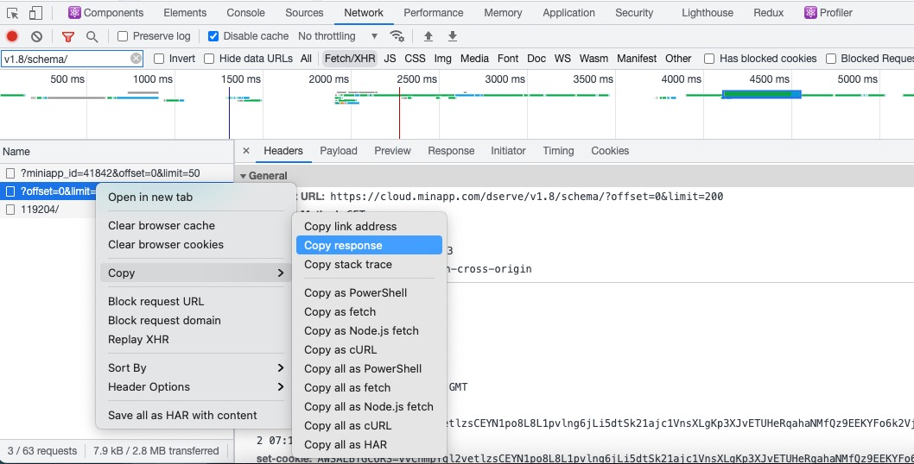

# @mincloud/convert-types

> 知晓云数据表 JSON 信息转为 typescript 类型文件

## Usage

进入知晓云控制面板后，打开浏览器开发者工具，在 network 找到 `dserve/v1.8/schema/?offset=0&limit=200` 这条请求，并将 response 保存为 `_schema.json` 文件放置到本项目的根目录。



在命令行执行命令:

``` shell
yarn generator
```

---

项目初始化使用 `yarn install` 或 `yarn` 安装依赖时会自动将 bin 安装到 node_modules 中。若在开发过程中修改了 bin 名称，可通过 `yarn link` 重新关联。

## TODO

- [x] 接入编译器/打包工具来处理源码
- [x] 脚本提供自定义配置 (commander)
- [ ] 封装为可供其他 package 使用的 cli 库
- [ ] Test Case
